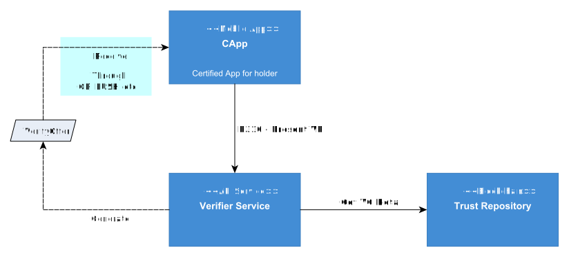

---
puppeteer:
    pdf:
        format: A4
        displayHeaderFooter: true
        landscape: false
        scale: 0.8
        margin:
            top: 1.2cm
            right: 1cm
            bottom: 1cm
            left: 1cm
    image:
        quality: 100
        fullPage: false
---

Verifier API
==

- 일자: 2024-08-19
- 버전: v1.0.0
  
목차
---
  - [1. 개요](#1-개요)
  - [2. 용어 설명](#2-용어-설명)
  - [3. API 목록](#3-api-목록)
    - [3.1. 순차 API](#31-순차-api)
    - [3.2. 단일호출 API](#32-단일호출-api)
  - [4. P310 - VP 제출 프로토콜](#4-p310---vp-제출-프로토콜)
    - [4.1. Request Offer (QR)](#41-request-offer-qr)
    - [4.2. Request Profile](#42-request-profile)
    - [4.3. Request Verify](#43-request-verify)
    - [4.4. Confirm Verify](#44-confirm-verify)
  - [5. 단일 호출 API](#5-단일-호출-api)
    - [5.1. Issue Certificate VC](#51-issue-certificate-vc)
    - [5.2. Get Certificate Vc](#52-get-certificate-vc)


## 1. 개요

본 문서는 Verifier Service가 제공하는 API를 정의한다.



- 상기 그림에서는 Verifier Service가 제공하거나 혹은 Verifier Service가 호출하는 프로토콜(Protocol)과 API를 표기하였으며, API는 가독성을 위하여 표준 API (Standard API)만을 표기하였다.
- 각 용어는 2장에서 설명하며, API 목록과 호출 예시 등은 3장 이후부터 확인할 수 있다.

<div style="page-break-after: always; margin-top: 50px;"></div>

## 2. 용어 설명
- 프로토콜 (Protocol)
  - 특정 기능을 수행하기 위해 정해진 순서에 따라 호출해야 하는 `순차 API`의 집합이다. API 호출 순서를 엄격히 따라야 하며, 순서가 잘못될 경우 예상하지 못한 결과가 발생할 수 있다.
  - 프로토콜은 P로 시작하고, 3자리 숫자로 구성된다. 
    - 예시: P310 - VP 제출 프로토콜
- 순차 API (Sequential API)
  - 특정 기능(프로토콜)을 수행하기 위해 정해진 순서대로 호출하는 일련의 API를 말한다. 각 API는 순차적으로 호출되어야 하며, 순서가 잘못될 경우 제대로 동작하지 않을 수 있다.
  - 그러나 일부 프로토콜에서는 같은 호출 순서를 가진 API가 존재할 수 있으며, 이 경우 하나의 API를 선택하여 호출할 수 있다.
- 단일 호출 API (Single Call API)
  - 일반적인 REST API처럼 순서에 관계없이 독립적으로 호출 가능한 API를 의미한다.
- 표준 API (Standard API)
  - API 문서에서 명확하게 정의된 API로, 모든 구현체에서 일관된 방식으로 제공되어야 한다. 표준 API는 시스템 간 상호 운용성을 보장하며, 사전에 정의된 스펙에 따라 동작해야 한다.
- 비표준 API (Non-Standard API)
  - 구현체마다 필요에 따라 다르게 정의되거나 커스터마이징될 수 있는 API이다. 본 문서에서 제공하는 비표준 API는 한 가지 예시일 뿐이며, 각 구현체에 맞춰 다르게 구현될 수 있다. 이 경우, 구현체별 별도의 문서화가 필요하다.
  - 예를 들어, VP 제출 결과 확인은 시스템에 따라 구현 방법이 달라질 수 있으며, `confirm-verify` API와 같은 비표준 API는 각 구현체에서 필요한 방식으로 재정의할 수 있다.

<div style="page-break-after: always; margin-top: 50px;"></div>

## 3. API 목록

### 3.1. 순차 API

#### 3.1.1. P310 - VP 제출 프로토콜
| Seq | API                | URL                      | Description             | 표준API |
| --- | ------------------ | ------------------------ | ----------------------- | ------- |
| 1   | `request-offer-qr` | /api/v1/request-offer-qr | VP 제출 Offer 요청 (QR) | N       |
| 2   | `request-profile`  | /api/v1/request-profile  | 제출 Profile 요청       | Y       |
| 3   | `request-verify`   | /api/v1/request-verify   | VP 제출                 | Y       |
| 4   | `confirm-verify`   | /api/v1/confirm-verify   | VP 제출 결과 확인       | N       |

<div style="page-break-after: always; margin-top: 40px;"></div>

### 3.2. 단일호출 API

| API                    | URL                    | Description      | 표준API |
| ---------------------- | ---------------------- | ---------------- | ------- |
| `issue-certificate-vc` | /api/v1/certificate-vc | Entity 등록 요청 | N       |
| `get-certificate-vc`   | /api/v1/certificate-vc | 가입증명서 조회  | N       |

<div style="page-break-after: always; margin-top: 50px;"></div>

## 4. P310 - VP 제출 프로토콜

| Seq. | API              | Description             | 표준API |
| :--: | ---------------- | ----------------------- | ------- |
|  1   | request-offer-qr | VP 제출 Offer 요청 (QR) | N       |
|  2   | request-profile  | 제출 Profile 요청       | Y       |
|  3   | request-verify   | VP 제출                 | Y       |
|  4   | confirm-verify   | VP 제출 결과 확인       | N       |

- VP 제출 프로토콜은 상황에 따라 API 호출자가 다양하기 때문에 메시지에 `txId`를 항상 첨부하기는 어렵다.
- 따라서 Verifier Service는 `txId`를 생성하여 응답할 수 있으나 요청문에 이를 포함하기를 강제하지는 않는다.

### 4.1. Request Offer (QR)

VP 제출 세션 정보를 요청한다.

Verifier는 제출 받을 VP의 정보를 이미 가지고 있어서, Verifier가 응대장치에게 제출 세션 정보를 제공할 수 있다. 이 제출 세션 정보를 "Verify Offer"라고 칭한다. 

해당 API는 Verify Offer의 Payload를 전송하며, 응대장치는 해당 Payload를 QR로 변환시켜 화면에 출력할 수 있다.

| Item          | Description                         | Remarks |
| ------------- | ----------------------------------- | ------- |
| Method        | `POST`                              |         |
| Path          | `/api/v1/request-offer-qr` |         |
| Authorization | -                                   |         |

#### 4.1.1. Request

**■ Path Parameters**

N/A

**■ Query Parameters**

N/A

**■ HTTP Body**

```c#
def object RequestOfferQr: "Request Offer QR 요청문"
{    
    - messageId "id": "message id"
    + PRESENT_MODE "mode": "VP 제출 모드" // 데이터 명세서 참고
    + itemName "device": "응대장치 식별자"
    + itemName "service": "서비스 식별자"
}
```

<div style="page-break-after: always; margin-top: 30px;"></div>

#### 4.1.2. Response

**■ Process**
1. mode, device, service로 VP Policy 조회
1. offerId 생성
1. offer 유효시간 생성 (validUntil)
1. Verify Offer Payload 생성
1. offerId 매핑하여 저장
    - mode, device, service, policyId, validUntil

**■ Status 200 - Success**

```c#
def object _RequestOfferQr: "Request Offer QR 응답문"
{    
    + uuid "txId"  : "transaction id"
    + VerifyOfferPayload "payload" : "제출 Offer Payload" // 데이터 명세서 참고
}
```

**■ Status 400 - Client error**

| 코드         | 설명                            |
| ------------ | ------------------------------- |
| SSRVVRF00201 | "VP_POLICY를 찾을 수 없습니다." |

**■ Status 500 - Server error**

| 코드         | 설명                                               |
| ------------ | -------------------------------------------------- |
| SSRVVRF00900 | "'request-offer-qr' API 요청 처리에 실패했습니다." |

<div style="page-break-after: always; margin-top: 30px;"></div>

#### 4.1.3. Example

**■ Request**

```shell
curl -v -X POST "http://${Host}:${Port}/verifier/api/v1/request-offer-qr" \
-H "Content-Type: application/json;charset=utf-8" \
-d @"data.json"
```

```json
{
   "id":"202303241738241234561234ABCD",
   "mode":"Direct",
   "device":"WEB",
   "service":"login"
}
```

**■ Response**

```http
HTTP/1.1 200 OK
Content-Type: application/json;charset=utf-8

{    
  "txId": "70e22f4e-ca60-48d3-88ee-a43d42ad3313",
  "payload": {
    "offerId": "3bf6a1a0-beca-4450-a01e-4e2166819504",
    "type": "VerifyOffer",
    "mode": "Direct",
    "device": "WEB",
    "service": "login",
    "endpoints": [
      "http://127.0.0.130:8092/verifier/api/v1/request-verify"
    ],
    "validUntil": "2024-01-01T08:44:58.048519445Z",
    "locked": false
  }
}
```

<div style="page-break-after: always; margin-top: 40px;"></div>

### 4.2. Request Profile

`offerId`를 제출하여 VerifyProfile을 요청한다.

| Item          | Description               | Remarks |
| ------------- | ------------------------- | ------- |
| Method        | `POST`                    |         |
| Path          | `/api/v1/request-profile` |         |
| Authorization | -                         |         |

#### 4.2.1. Request

**■ Headers**

| Header           | Value                            | Remarks |
| ---------------- | -------------------------------- | ------- |
| + `Content-Type` | `application/json;charset=utf-8` |         |

**■ Path Parameters**

N/A

**■ Query Parameters**

N/A

**■ Body**

```c#
def object M310_RequestProfile: "Request Profile 요청문"
{
    //--- Common Part ---
    + messageId "id"  : "message id"
    - uuid      "txId": "transaction id"

    //--- Data Part ---
    + uuid "offerId" : "verify offer id"
}
```

<div style="page-break-after: always; margin-top: 30px;"></div>

#### 4.2.2. Response

**■ Process**

1. (필요시)거래코드 확인
1. `offerId` 유효성 확인
1. `profile` = VerifyProfile 생성하여 서명 첨부

**■ Status 200 - Success**

```c#
def object _M310_RequestProfile: "Request Profile 응답문"
{    
    //--- Common Part ---
    + uuid "txId": "transaction id"

    //--- Data Part ---
    + VerifyProfile "profile": "verify profile"
}
```

**■ Status 400 - Client error**

|     Code     | Description                           |
| :----------: | ------------------------------------- |
| SSRVVRF00200 | "VP_OFFER를 찾을 수 없습니다."        |
| SSRVVRF00201 | "VP_POLICY를 찾을 수 없습니다."       |
| SSRVVRF00300 | "트랜잭션을 찾을 수 없습니다."        |
| SSRVVRF00301 | "트랜잭션 상태가 대기 중이 아닙니다." |
| SSRVVRF00302 | "트랜잭션이 만료되었습니다."          |
| SSRVVRF00303 | "하위 트랜잭션을 찾을 수 없습니다."   |

**■ Status 500 - Server error**

|     Code     | Description                                       |
| :----------: | ------------------------------------------------- |
| SSRVVRF00401 | "암호화 오류가 발생했습니다."                     |
| SSRVVRF00408 | "키 쌍 생성에 실패했습니다."                      |
| SSRVVRF00502 | "공개 키 압축에 실패했습니다."                    |
| SSRVVRF00600 | "DID 문서 검색에 실패했습니다."                   |
| SSRVVRF00902 | "'request-profile' API 요청 처리에 실패했습니다." |

<div style="page-break-after: always; margin-top: 30px;"></div>

#### 4.2.3. Example

**■ Request**

```shell
curl -v -X POST "http://${Host}:${Port}/verifier/api/v1/request-profile" \
-H "Content-Type: application/json;charset=utf-8" \
-d @"data.json"
```

```json
//data.json
{
  "txId": "b38aa1e3-48fa-4f5f-be60-05042d9ec660",
  "offerId": "3bf6a1a0-beca-4450-a01e-4e2166819504",
  "id": "202303241738241234561234ABCD"
}
```

**■ Response**

```http
HTTP/1.1 200 OK
Content-Type: application/json;charset=utf-8
{
  "txId": "b38aa1e3-48fa-4f5f-be60-05042d9ec660",
  "profile": {
    "id": "b8302842-0d9b-4f95-9da8-5ae3bbf8dd69",
    "type": "VerifyProfile",
    "title": "OpenDID 로그인 VP 프로파일",
    "description": "OpenDID 로그인을 위해 제출이 필요한 VP에 대한 프로파일 입니다.",
    "encoding": "UTF-8",
    "language": "ko",
    "profile": {
      "verifier": {
        "did": "did:omn:verifier",
        "certVcRef": "http://127.0.0.130:8092/verifier/api/v1/certificate-vc",
        "name": "verifier",
        "description": "verifier",
        "ref": "http://127.0.0.130:8092/swagger-ui/index.html#/"
      },
      "filter": {
        "credentialSchemas": [
          {
            "id": "http://127.0.0.130:8091/issuer/api/v1/vc/vcschema?name=mdl",
            "type": "OsdSchemaCredential",
            "value": "VerifiableProfile",
            "presentAll": false,
            "displayClaims": [
              "testId.aa"
            ],
            "requiredClaims": [
              "org.iso.18013.5.birth_date",
              "org.iso.18013.5.family_name",
              "org.iso.18013.5.given_name"
            ],
            "allowedIssuers": [
              "did:omn:issuer"
            ]
          }
        ]
      },
      "process": {
        "endpoints": [
          "http://127.0.0.130:8092/verifier/api/v1/request-verify"
        ],
        "reqE2e": {
          "nonce": "mLXd8kMD3pb4WRAnchWudXA",
          "curve": "Secp256r1",
          "publicKey": "z26VWT8GTUxNdRAXUThK4rRPzAeWsXf7....",
          "cipher": "AES-256-CBC",
          "padding": "PKCS5"
        },
        "verifierNonce": "mLXd8kMD3pb4WRAnchWudXA",
        "authType": 6
      }
    },
    "proof": {
      "type": "Secp256r1Signature2018",
      "created": "2024-10-25T17:42:09.060550Z",
      "verificationMethod": "did:omn:verifier?versionId=1#assert",
      "proofPurpose": "assertionMethod",
      "proofValue": "z3m8feWmLrhsYkym2PcfmpHe1sRkL5BQba4d...."
    }
  }
}
```

<div style="page-break-after: always; margin-top: 40px;"></div>

### 4.3. Request Verify

암호화된 VP를 수신하여 복호화하고 검증 후 서비스를 제공한다.

| Item          | Description              | Remarks |
| ------------- | ------------------------ | ------- |
| Method        | `POST`                   |         |
| Path          | `/api/v1/request-verify` |         |
| Authorization | -                        |         |

#### 4.3.1. Request

**■ Headers**

| Header           | Value                            | Remarks |
| ---------------- | -------------------------------- | ------- |
| + `Content-Type` | `application/json;charset=utf-8` |         |

**■ Path Parameters**

N/A

**■ Query Parameters**

N/A

**■ Body**

```c#
def object M310_RequestVerify: "Request Verify 요청문"
{
    //--- Common Part ---
    + messageId "id"  : "message id"
    - uuid      "txId": "transaction id"

    //--- Data Part ---
    + AccE2e    "accE2e": "E2E 수락정보"
    + multibase "encVp" : "multibase(enc((Vp)vp))"
}
```

- `~/accE2e`: `VerifyProfile:~/profile/process/reqE2e`에 대응한 E2E 수락정보
- `~/encVp`: E2E 키로 암호화된 VP

<div style="page-break-after: always; margin-top: 30px;"></div>

#### 4.3.2. Response

E2E 수락정보를 이용하여 E2E 암호화키를 생성하고, VP를 복호화한다.
VP 내의 verifierNonce가 검증 사업자가 제공한 것과 일치하는지 확인하여야 한다.

**■ Process**

1. 거래코드 확인
1. (있으면)`accE2e.proof` 서명 검증
1. E2E ECDH 수행
    - `e2eKey` = 암호화키 생성
    - `iv` = accE2e.iv
1. `encVp` 복호화
    - vp = dec(debase(encVp), e2eKey, iv, padding)
1. `vp` 내용 확인
    - `profile/process/verifierNonce` 일치여부 확인
    - 이슈어 서명 검증
1. 부인방지가 필요한 경우 `vp` 암호화하여 저장 (암호화 방법은 out of scope)
1. 서비스 제공 (검증 사업자의 서비스에 따름)

**■ Status 200 - Success**

```c#
def object _M310_RequestVerify: "Request Verify 응답문"
{    
    //--- Common Part ---
    + uuid "txId": "transaction id"
}
```

**■ Status 400 - Client error**

|     Code     | Description                               |
| :----------: | ----------------------------------------- |
| SSRVVRF00107 | "데이터 디코딩 실패: 잘못된 인코딩"       |
| SSRVVRF00300 | "트랜잭션을 찾을 수 없습니다."            |
| SSRVVRF00301 | "트랜잭션 상태가 유효하지 않습니다."      |
| SSRVVRF00302 | "트랜잭션이 만료되었습니다."              |
| SSRVVRF00303 | "하위 트랜잭션을 찾을 수 없습니다."       |
| SSRVVRF00304 | "하위 트랜잭션 상태가 유효하지 않습니다." |
| SSRVVRF00402 | "유효하지 않은 nonce입니다."              |
| SSRVVRF00403 | "유효하지 않은 ProofPurpose 입니다."      |

**■ Status 500 - Server error**

|     Code     | Description                                      |
| :----------: | ------------------------------------------------ |
| SSRVVRF00101 | "JSON 파싱에 실패했습니다."                      |
| SSRVVRF00103 | "블록체인에서 DID Doc 검색에 실패했습니다."      |
| SSRVVRF00104 | "서명 검증에 실패했습니다."                      |
| SSRVVRF00105 | "해시 생성에 실패했습니다."                      |
| SSRVVRF00106 | "데이터 인코딩에 실패했습니다."                  |
| SSRVVRF00202 | "VP 검증에 실패했습니다."                        |
| SSRVVRF00204 | "VP 프로파일 파싱에 실패했습니다."               |
| SSRVVRF00400 | "유효하지 않은 AuthType: 유형 불일치."           |
| SSRVVRF00401 | "암호화 오류가 발생했습니다."                    |
| SSRVVRF00601 | "DID Doc을 찾는데 실패했습니다."                 |
| SSRVVRF00700 | "E2E를 찾을 수 없습니다."                        |
| SSRVVRF00701 | "E2E가 유효하지 않습니다."                       |
| SSRVVRF00903 | "'request-verify' API 요청 처리에 실패했습니다." |

<div style="page-break-after: always; margin-top: 30px;"></div>

#### 4.3.3. Example

**■ Request**

```shell
curl -v -X POST "http://${Host}:${Port}/verifier/api/v1/request-verify" \
-H "Content-Type: application/json;charset=utf-8" \
-d @"data.json"
```

```json
{
    {
    "accE2e": {
      "iv": "z2SXXDRzxTyKt8ua7Y96GPK",
      "proof": {
        "created": "2024-01-01T06:32:33Z",
        "proofPurpose": "keyAgreement",
        "proofValue": "z3odiy3M5SJMGzXHXyQZKEFMXaqPGcBVyTPYKURKA....",//encodeData
        "type": "Secp256r1Signature2018",
        "verificationMethod": "did:omn:iuBdTVmXCwntmEtjPR5eYZRLM5W?versionId=1#keyagree"
      },
      "publicKey": "z21hpr3CASVzgJ2azYZtxzedTmKyKLRoaNGiK9vGfLPCQJ"
    },
    "encVp": "zRedoZXk23311kmCg4yKEwLBAxz2RG4P6hopt9Dn4CS....",//encodeData
    "id": "202410241532334100006CE70B2E",
    "txId": "a3333175-a799-4ae3-8f9c-5b9f4c0f579f"
  }
}
```

**■ Response**

```http
HTTP/1.1 200 OK
Content-Type: application/json;charset=utf-8

{
    "txId":"a3333175-a799-4ae3-8f9c-5b9f4c0f579f"
}
```

<div style="page-break-after: always; margin-top: 40px;"></div>

### 4.4. Confirm Verify

VP 제출 결과를 조회한다.

인가앱에서 제출한 VP에서 클레임 정보들도 추출하여 전달한다. 클레임은 개인정보가 포함되어 있을 수 있으나, 테스트의 편의성을 위하여 따로 암호화를 처리를 하지 않는다.

| Item          | Description              | Remarks |
| ------------- | ------------------------ | ------- |
| Method        | `POST`                   |         |
| Path          | `/api/v1/confirm-verify` |         |
| Authorization | -                        |         |

#### 4.4.1. Request

**■ Path Parameters**

N/A

**■ Query Parameters**

N/A

**■ HTTP Body**

```c#
def object ConfirmVerify: "Confirm Verify 요청문"
{    
    + uuid  "offerId": "제출 offer id" 
}
```

<div style="page-break-after: always; margin-top: 30px;"></div>

#### 4.4.2. Response

**■ Process**
1. offerId로 VP 제출 정보 조회
1. VP 제출 정보에서 클레임 정보 추출

**■ Status 200 - Success**

```c#
def object _ConfirmVerify: "Confirm Verify 응답문"
{    
    + bool "result": "VP 제출 결과"
    - array(Claim) "claims" : "제출한 클레임 정보" // 데이터 명세서 참고
}
```

**■ Status 400 - Client error**

| 코드         | 설명                           |
| ------------ | ------------------------------ |
| SSRVVRF00300 | "트랜잭션을 찾을 수 없습니다." |
| SSRVVRF00200 | "VP_OFFER를 찾을 수 없습니다." |

**■ Status 500 - Server error**

| 코드         | 설명                                             |
| ------------ | ------------------------------------------------ |
| SSRVVRF00901 | "'confirm-verify' API 요청 처리에 실패했습니다." |

<div style="page-break-after: always; margin-top: 30px;"></div>

#### 4.4.3. Example

**■ Request**

```shell
curl -v -X POST "http://${Host}:${Port}/verifier/api/v1/confirm-verify" \
-H "Content-Type: application/json;charset=utf-8" \
-d @"data.json"
```

```json
{    
  "offerId":"5e6af61a-96f3-42db-9359-d4299f6e7a8f"
}
```

**■ Response**

```http
HTTP/1.1 200 OK
Content-Type: application/json;charset=utf-8

{
    "claims": [
        {
        "code": "org.iso.18013.5.family_name",
        "caption": "Family Name",
        "value": "Kim",
        "type": "text",
        "format": "plain",
        "hideValue": false
        },
        {
        "code": "org.iso.18013.5.given_name",
        "caption": "Given Name",
        "value": "Raon",
        "type": "text",
        "format": "plain",
        "hideValue": false
        },
        {
        "code": "org.iso.18013.5.birth_date",
        "caption": "Birth date",
        "value": "2024-01-01",
        "type": "text",
        "format": "plain",
        "hideValue": false
        }
    ],
    "result": true
}
```

<div style="page-break-after: always; margin-top: 50px;"></div>

## 5. 단일 호출 API

단일 호출 API는 특정 기능을 수행하는 하나의 독립된 API이다.
따라서 순서대로 호출해야 하는 API의 집단인 순차 API(aka, 프로토콜)이 아니므로 프로토콜 번호가 부여되지 않는다.
Verifier Service가 제공하는 단일 호출 API 목록은 아래 표와 같다.

| API                    | URL                    | Description      | 표준API |
| ---------------------- | ---------------------- | ---------------- | ------- |
| `issue-certificate-vc` | /api/v1/certificate-vc | Entity 등록 요청 | N       |
| `get-certificate-vc`   | /api/v1/certificate-vc | 가입증명서 조회  | N       |

■ Authorization

프로토콜에는 '호출자의 호출 권한을 확인'(authorization)하는 API가 포함되어 있다.
상기 목록의 단일 호출 API는 authroization에 대하여 정의하지 않았으나,
향후 다음의 방안을 고려하여 추가할 예정이다.

- 1안) 인가앱 사업자가 서명한 `AttestedAppInfo` 정보를 확인한 후 일정기간 사용이 가능한 토큰을 발급
    - 단일 API 호출 시 헤더에 TAS 발행 토큰을 첨부
    - 별도의 토큰 관리 API 필요
- 2안) 인가앱 사업자가 인가앱에 토큰을 발행하고 TAS가 인가앱 사업자에 토큰 검증을 요청
    - 단일 API 호출 시 헤더에 인가앱 사업자 발행 토큰을 첨부
    - 인가앱 사업자가 토큰을 발행하고 검증해주는 기능 구현 필요
  
### 5.1. Issue Certificate VC

가입증명서 발급을 요청한다.

Verifier의 DID Document가 TAS 관리자를 통하여 저장소(예:블록체인)에 이미 등록되어 있어야 한다.
이 API에서는 TAS의 P120 프로토콜 API를 순서대로 호출하여 가입증명서를 발급 받는다.

| Item          | Description              | Remarks |
| ------------- | ------------------------ | ------- |
| Method        | `POST`                   |         |
| Path          | `/api/v1/certificate-vc` |         |
| Authorization | -                        |         |

#### 5.1.1. Request

**■ Path Parameters**

N/A

**■ Query Parameters**

N/A

**■ HTTP Body**

```c#
def object IssueCertificateVc: "Issue Certificate VC 요청문"
{    
}
```

<div style="page-break-after: always; margin-top: 30px;"></div>

#### 5.1.2. Response

**■ Process**
1. TA P120 프로토콜의 API를 순서대로 호출
1. 발급받은 가입증명서를 DB에 저장

**■ Status 200 - Success**

```c#
def object _IssueCertificateVc: "Issue Certificate VC 응답문"
{    
}
```

**■ Status 400 - Client error**

N/A

**■ Status 500 - Server error**

| Code | Description |
| ---- | ----------- |
| SSRVVRF00401 | "암호화 오류가 발생했습니다." |
| SSRVVRF00905 | "'issue-certificate-vc' API 요청 처리에 실패했습니다."

<div style="page-break-after: always; margin-top: 30px;"></div>

#### 5.1.3. Example

**■ Request**

```shell
curl -v -X POST "http://${Host}:${Port}/verifier/api/v1/certificate-vc" \
-H "Content-Type: application/json;charset=utf-8" \
-d @"data.json"
```

```json
{
  //no data   
}
```

**■ Response**

```http
HTTP/1.1 200 OK
Content-Type: application/json;charset=utf-8
{
    //no data
}
```

<div style="page-break-after: always; margin-top: 40px;"></div>

### 5.2. Get Certificate Vc

가입증명서를 조회한다.

| Item          | Description              | Remarks |
| ------------- | ------------------------ | ------- |
| Method        | `GET`                    |         |
| Path          | `/api/v1/certificate-vc` |         |
| Authorization | -                        |         |

#### 5.2.1. Request

**■ HTTP Headers**

| Header           | Value                            | Remarks |
| ---------------- | -------------------------------- | ------- |
| + `Content-Type` | `application/json;charset=utf-8` |         |     

**■ Path Parameters**

N/A

**■ Query Parameters**

N/A

**■ HTTP Body**

N/A

<div style="page-break-after: always; margin-top: 30px;"></div>

#### 5.2.2. Response

**■ Process**
1. 가입증명서 조회

**■ Status 200 - Success**

```c#
def object _GetCertificateVc: "Get Certificate VC 응답문"
{
    @spread(Vc)  // 데이터 명세서 참고
}
```

**■ Status 400 - Client error**

N/A

**■ Status 500 - Server error**

| Code         | Description                                      |
| ------------ | ------------------------------------------------ |
| SSRVVRF00800 | "인증서 VC 데이터를 찾을 수 없습니다."           |
| SSRVVRF00904 | "'certificate-vc' API 요청 처리에 실패했습니다." |

<div style="page-break-after: always; margin-top: 30px;"></div>

#### 5.2.3. Example

**■ Request**

```shell
curl -v -X GET "http://${Host}:${Port}/verifier/api/v1/certificate-vc"
```

**■ Response**

```http
HTTP/1.1 200 OK
Content-Type: application/json;charset=utf-8

{
  "@context": [
    "https://www.w3.org/ns/credentials/v2"
  ],
  "credentialSchema": {
    "id": "http://127.0.0.1:8090/tas/api/v1/vc-schema?name=certificate",
    "type": "OsdSchemaCredential"
  },
  "credentialSubject": {
    "claims": [
      {
        "caption": "subject",
        "code": "org.opendid.v1.subject",
        "format": "plain",
        "hideValue": false,
        "type": "text",
        "value": "o=Verifier"
      },
      {
        "caption": "role",
        "code": "org.opendid.v1.role",
        "format": "plain",
        "hideValue": false,
        "type": "text",
        "value": "Verifier"
      }
    ],
    "id": "did:omn:verifier"
  },
  "encoding": "UTF-8",
  "evidence": [
    {
      "attribute": {
        "licenseNumber": "1234567890"
      },
      "documentPresence": "Physical",
      "evidenceDocument": "BusinessLicense",
      "subjectPresence": "Physical",
      "type": "DocumentVerification",
      "verifier": "did:omn:tas"
    }
  ],
  "formatVersion": "1.0",
  "id": "0815ebc5-7264-45cc-8c6c-4db17640a4b7",
  "issuanceDate": "2024-01-01T09:50:19Z",
  "issuer": {
    "id": "did:omn:tas",
    "name": "raonsecure"
  },
  "language": "ko",
  "proof": {
    "created": "2024-01-01T09:50:19Z",
    "proofPurpose": "assertionMethod",
    "proofValue": "mH8dkYyG51tSSLqrQxmdXTh...",
    "proofValueList": [
      "mIIvBGv2JJk6XSmXQnJIMU...",
      "mH58hKzV3+OI98K2P4n6Hq..."
    ],
    "type": "Secp256r1Signature2018",
    "verificationMethod": "did:omn:tas?versionId=1#assert"
  },
  "type": [
    "VerifiableCredential",
    "CertificateVC"
  ],
  "validFrom": "2024-01-01T09:50:19Z",
  "validUntil": "2025-01-01T09:50:19Z"
}
```